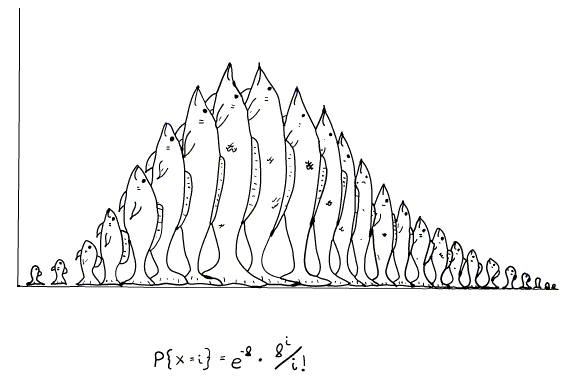

<style type="text/css">
.title {
  display: none;
}

# getting-started img {
  margin-right: 10px;
}

</style>

<div class="row" style="padding-top: 30px;">
<div class="col-sm-6">

# **Han's Research Journal**

This is my first learning and research journal.

</div>
<div class="col-sm-6", style= "text-align:right;">

```{r logo, fig.height=2, fig.width=2, echo=FALSE, fig.align="center", out.extra="id=logo"}

```

</div>
